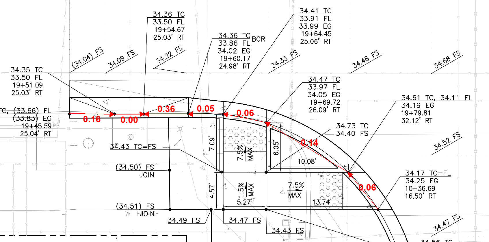

# PDF-flowline

**A lightweight desktop tool for civil engineers: box-select elevation numbers on scanned grading plans and automatically generate flow direction arrows.**



---

## What it does

Open a scanned PDF grading plan, click the physical measurement points on the map, box-select the corresponding elevation numbers, and the tool will:

- OCR the elevation values using **PP-OCRv6 tiny_rec (local ONNX Runtime)** — no API key, no internet required
- Compute elevation differences (Δ) between consecutive points
- Draw red flow direction arrows with delta labels
- **Calibrate the drawing scale** (click two points of known distance) to also display **run length (L)** and **slope (S%)** on every arrow
- Automatically identify **HP (High Point)** and **LP (Low Point)** extrema
- Export the annotated plan as WYSIWYG image (PNG/JPG) **or** native PDF vector annotations

> Built by a practicing civil engineer for civil engineers.

---

## Why PP-OCRv6? (Technical Rationale)

This tool relies on **vision-based OCR** to read elevation numbers (e.g. "31.95 FS") from scanned PDF pages — often on grayscale, noisy or hand-annotated grading plans.

- **PP-OCRv6 tiny_rec** (Baidu PaddleOCR, released 2026.6.11) is a dedicated OCR recognition model with only **1.1M parameters**.
- It runs locally via **ONNX Runtime** — no GPU needed, no cloud dependency, ~2ms per inference.
- Achieves **94–99.99% confidence** on elevation numbers with suffixes (FS, EL) and HP/LP labels.
- **4-angle rotation handling**: automatically tries 0°/90°/180°/270° and picks the highest-confidence result, so rotated numbers on PDFs are recognized correctly.
- The full pipeline replaces the previous Google Gemini API OCR — removing API costs, network dependency, and configuration overhead.

---

## 🚀 Quick Start (EXE users — no Python required)

1. Download `FlowlineChecker.exe` from the **[Releases](https://github.com/wyuebei-cloud/PDF-flowline/releases)** page.
2. Double-click `FlowlineChecker.exe` to launch.
3. Click **Open PDF**, select your grading plan, and start drawing.

> **No API key, no internet, no configuration.** The 4.3MB ONNX model is embedded in the EXE. OCR runs entirely offline.

---

## 💻 Running from Source

```bash
# Clone the repo
git clone https://github.com/wyuebei-cloud/PDF-flowline.git
cd PDF-flowline

# Create virtual environment and install dependencies
python -m venv venv
# Windows:
venv\Scripts\activate
pip install paddleocr onnxruntime opencv-python pillow numpy PyQt6 pymupdf

# Launch (model auto-downloads on first run)
python flowline_checker\main.py
```

---

## 🛠 Basic Workflow

| Step | Action |
|------|--------|
| 1 | Click **Draw Flowline** on the toolbar (cursor becomes a red crosshair) |
| 2 | Click the **physical location** on the plan where elevation is measured |
| 3 | Immediately **box-select** the elevation text (e.g. "31.95 FS") |
| 4 | A blue label appears — the app returns to drawing mode **without waiting** |
| 5 | Repeat step 2–4 for subsequent points |
| 6 | Click **Done** to finalize → arrows, deltas, HP/LP labels are generated |

- **Edit** a blue number: single-click it before pressing Done
- **Select/Deselect** an arrow: click it (blue dashed box appears)
- **Delete** selected arrow: press `Delete`
- **Undo**: `Ctrl+Z`
- **Cancel** current segment: `Esc`
- **Export Image**: `Ctrl+S` (WYSIWYG high-res PNG/JPG)
- **Export PDF**: `Ctrl+E` (native vector annotations)

### Styling
- **Arrow Size slider** — adjusts arrowhead and line thickness globally in real time
- **Text Size slider** — adjusts delta (Δ) and HP/LP label font size

---

## 📦 Repository Structure

```
PDF-flowline/
├── flowline_checker/         # Source code
│   ├── main.py               # Entry point
│   ├── core/
│   │   ├── ocr_engine.py     # PP-OCRv6 tiny_rec (local ONNX)
│   │   └── pdf_handler.py    # PDF rendering, annotation, export
│   ├── ui/
│   │   ├── main_window.py    # Main window with toolbar
│   │   ├── pdf_viewer.py     # PDF viewer (pan/zoom)
│   │   ├── selection_overlay.py   # Selection box overlay
│   │   └── value_dialog.py   # Manual value edit dialog
│   └── models/
│       └── data_types.py     # ElevationPoint / FlowArrow data models
├── USER_GUIDE.md             # Full user manual (English & Chinese)
├── design_history_log.md     # Development design log (bilingual)
├── LICENSE                   # MIT License
└── README.md                 # This file
```

The pre-compiled `FlowlineChecker.exe` is distributed via **GitHub Releases**, not stored in the source tree.

---

## 📝 License

This project is licensed under the **MIT License** — see [LICENSE](LICENSE) for details.

---

*Made by a PE at KPFF. First-gen Chinese immigrant in the PNW. Licensed PE (WA/OR) since 2013.*
